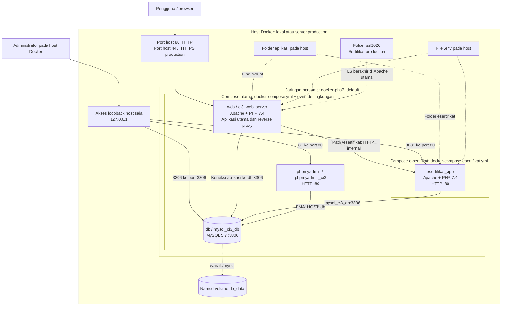
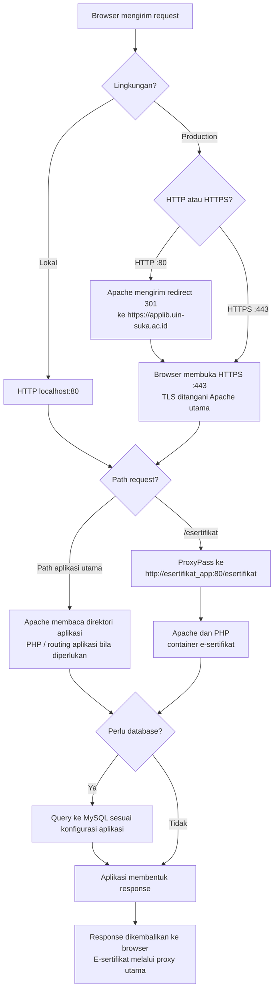
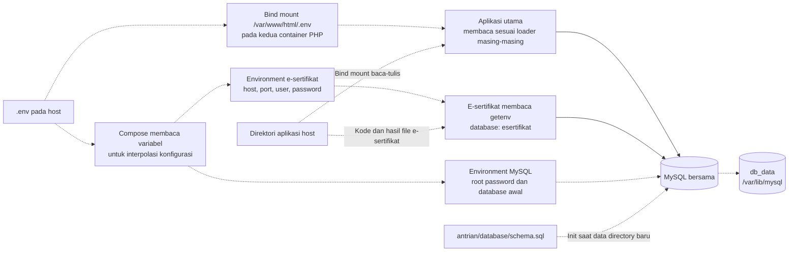
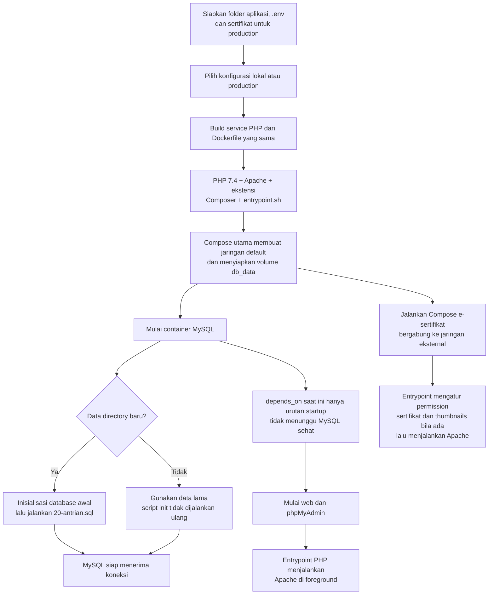

# Arsitektur Docker PHP 7

Dokumen ini memetakan konfigurasi repository per 25 September 2026. Diagram menggambarkan konfigurasi yang didefinisikan dalam file, bukan jaminan bahwa seluruh service sedang berjalan. Pemeriksaan runtime sebelumnya terhalang izin akses Docker Engine.

Platform menjalankan sepuluh direktori aplikasi dalam satu container Apache + PHP 7.4, satu container khusus e-sertifikat, satu server MySQL 5.7 bersama, dan phpMyAdmin. Apache pada container utama sekaligus menjadi reverse proxy untuk e-sertifikat.

Diagram menggunakan Mermaid. Buka Markdown Preview yang mendukung Mermaid untuk menampilkan flowchart. Panah penuh menunjukkan alur komunikasi atau proses; panah putus-putus menunjukkan pemasangan file, konfigurasi, atau penyimpanan.

## 1. Gambaran arsitektur



Nama jaringan `docker-php7_default` diasumsikan berasal dari nama project Compose `docker-php7`. File Compose e-sertifikat menunjuk nama jaringan ini secara eksplisit sebagai jaringan eksternal. Jika nama project utama diubah, referensi jaringan e-sertifikat harus disesuaikan.

Koneksi antar-container memakai nama service/container dan port internal. Reverse proxy mengakses `esertifikat_app:80`, bukan port host `8081`. Jaringan Docker ini juga bukan loopback `localhost` milik container.

## 2. Komponen dan batas sumber daya

| Service           | Container         | Peran                                             | Batas memori / CPU  | Restart          |
| ----------------- | ----------------- | ------------------------------------------------- | ------------------- | ---------------- |
| `web`             | `ci3_web_server`  | Menjalankan aplikasi utama dan proxy e-sertifikat | `2500M` / `2.0` CPU | `unless-stopped` |
| `db`              | `mysql_ci3_db`    | Server database bersama                           | `1500M` / `1.0` CPU | `unless-stopped` |
| `phpmyadmin`      | `phpmyadmin_ci3`  | Antarmuka administrasi database                   | Tidak ditentukan    | `no`             |
| `esertifikat_app` | `esertifikat_app` | Menjalankan aplikasi e-sertifikat                 | `2G` / `1.5` CPU    | `unless-stopped` |

`web` dan `esertifikat_app` masing-masing mendefinisikan reservasi memori `256M`. Nilai CPU adalah batas pemakaian, bukan alokasi core fisik khusus. Semua service tetap berbagi sumber daya host; kapasitas host juga harus menyediakan ruang untuk OS, Docker, dan phpMyAdmin.

Kedua service PHP dibangun dari `Dockerfile` yang sama, berbasis `php:7.4-apache`. Dockerfile memasang ekstensi `gd`, `mysqli`, `pdo`, `pdo_mysql`, `zip`, dan `opcache`, serta modul Apache untuk rewrite, header, SSL, kompresi, cache, dan proxy. Tidak ada service PHP-FPM, Nginx, Redis, atau load balancer terpisah dalam Compose yang diperiksa.

## 3. Alur request pengguna



Pada production, proxy meneruskan `Host` dan mengatur `X-Forwarded-Proto: https`. Hubungan Apache utama ke e-sertifikat menggunakan HTTP internal. File statis dapat dilayani langsung oleh Apache tanpa query database; request PHP mengikuti routing masing-masing aplikasi.

Path `/esertifikat` membutuhkan container e-sertifikat yang aktif dan terhubung ke jaringan bersama. Container tersebut tidak tercantum sebagai dependency service `web`.

## 4. Direktori aplikasi dan URL

Document root kedua container PHP adalah `/var/www/html`.

| URL relatif    | Sumber pada host | Lokasi dalam container      | Container                        |
| -------------- | ---------------- | --------------------------- | -------------------------------- |
| `/absensi`     | `./absensi`      | `/var/www/html/absensi`     | `ci3_web_server`                 |
| `/bmn`         | `./bmn`          | `/var/www/html/bmn`         | `ci3_web_server`                 |
| `/serial`      | `./serial`       | `/var/www/html/serial`      | `ci3_web_server`                 |
| `/report`      | `./report`       | `/var/www/html/report`      | `ci3_web_server`                 |
| `/loker`       | `./loker`        | `/var/www/html/loker`       | `ci3_web_server`                 |
| `/new_loker`   | `./new_loker`    | `/var/www/html/new_loker`   | `ci3_web_server`                 |
| `/pintumasuk`  | `./pintumasuk`   | `/var/www/html/pintumasuk`  | `ci3_web_server`                 |
| `/trans`       | `./trans`        | `/var/www/html/trans`       | `ci3_web_server`                 |
| `/carrel`      | `./carrel`       | `/var/www/html/carrel`      | `ci3_web_server`                 |
| `/antrian`     | `./antrian`      | `/var/www/html/antrian`     | `ci3_web_server`                 |
| `/esertifikat` | `./esertifikat`  | `/var/www/html/esertifikat` | `esertifikat_app`, melalui proxy |

Tabel menunjukkan mount yang didefinisikan, bukan hasil uji ketersediaan setiap URL. Khusus `report` dan `trans`, file `application/config/database.php` tidak ditemukan pada path yang diperiksa sehingga detail koneksi databasenya tidak diasumsikan.

## 5. Konfigurasi, database, dan persistensi



- **Konfigurasi aplikasi:** mount `.env` menyediakan file. Mount tersebut tidak otomatis membuat semua isinya menjadi environment proses PHP. Sebagian aplikasi mem-parsing file; e-sertifikat membaca variabel koneksi melalui `getenv()` dan menerima environment eksplisit dari Compose.
- **Database utama:** Compose menginisialisasi nama database dari `DB_DATABASE`, dengan fallback `ci3_db`. Database yang digunakan aplikasi dapat berbeda, misalnya melalui `DB_DATABASE_ABSENSI`, `DB_DATABASE_BMN`, `DB_DATABASE_SERIAL`, `DB_DATABASE_LOKER`, dan `DB_DATABASE_CARREL`.
- **Antrian:** memakai `DB_DATABASE_ANTRIAN`, dengan fallback `antrian`. SQL inisialisasi secara eksplisit membuat dan memilih database `antrian`; perubahan nama melalui `.env` perlu diselaraskan dengan SQL tersebut.
- **E-sertifikat:** konfigurasi PHP menetapkan nama database `esertifikat`. Compose menunjuk host `mysql_ci3_db`; database ini tidak otomatis dibuat hanya karena environment service PHP berisi `DB_DATABASE=esertifikat`.
- **Koneksi tambahan:** beberapa aplikasi memiliki grup koneksi lain, misalnya SIPRUS dengan `DB_HOST_IP4` atau host dari konfigurasi bersama. Tujuan aktual mengikuti konfigurasi aplikasi dan `.env`; diagram utama merangkum koneksi MySQL lokal dan tidak menyatakan semua integrasi berada dalam Docker ini.
- **Persistensi MySQL:** data berada pada named volume `db_data` (umumnya bernama `docker-php7_db_data`). Pembuatan ulang container tidak sama dengan penghapusan volume.
- **Persistensi file aplikasi:** kode, upload, dan hasil generasi yang ditulis ke direktori bind mount tersimpan pada filesystem host. File yang ditulis di luar mount mengikuti filesystem container.
- **Bootstrap SQL:** `20-antrian.sql` dipasang read-only. Script init dijalankan saat inisialisasi MySQL baru; bukan mekanisme migrasi otomatis untuk volume yang sudah berisi database.

## 6. Lokal dan production

| Aspek                | Development lokal                       | Production                                   |
| -------------------- | --------------------------------------- | -------------------------------------------- |
| File utama           | `docker-compose.yml`                    | `docker-compose.yml`                         |
| Tambahan konfigurasi | `docker-compose.override.yml`           | `docker-compose.prod.yml`                    |
| Vhost utama          | `vhost.conf`                            | `vhost-ssl.conf`                             |
| Port web host        | `80:80`                                 | `80:80` dan `443:443`                        |
| HTTPS                | Tidak dikonfigurasi pada override lokal | TLS pada Apache utama                        |
| Sertifikat           | Tidak dipasang                          | `./ssl2026` ke `/home/siprusmbr/docker-php7` |
| E-sertifikat         | File Compose tersendiri                 | File Compose tersendiri                      |

Base Compose sendiri tidak mempublikasikan port `web` dan tidak memasang vhost khusus. Override lingkungan melengkapi keduanya. Port `80` dan `443` tidak dibatasi ke loopback oleh mapping Compose; akses dari luar tetap bergantung pada jaringan dan firewall host.

File sertifikat production yang dirujuk vhost adalah `applib.uin-suka.ac.id.crt`, `server.key`, dan `CAIntermediate.crt`. File vhost terpilih dipasang ke `/etc/apache2/sites-enabled/000-default.conf`.

| Akses administrasi pada host Docker | Tujuan                                        |
| ----------------------------------- | --------------------------------------------- |
| `http://127.0.0.1:81`               | phpMyAdmin                                    |
| `127.0.0.1:3306`                    | MySQL dari client pada host                   |
| `http://127.0.0.1:8081/esertifikat` | E-sertifikat langsung untuk pemeriksaan lokal |

Alamat `127.0.0.1` mengacu ke mesin tempat perintah atau browser dijalankan. Pada production, akses loopback ini berada di server, bukan otomatis di laptop administrator.

## 7. Alur build dan startup



Perintah untuk menjalankan lingkungan lokal:

```bash
docker compose up -d --build
docker compose -f docker-compose.esertifikat.yml up -d --build
```

Perintah untuk menjalankan production:

```bash
docker compose -f docker-compose.yml -f docker-compose.prod.yml up -d --build
docker compose -f docker-compose.esertifikat.yml up -d --build
```

Perintah di atas merupakan petunjuk operasi, bukan perintah yang dijalankan saat pembuatan dokumen ini. Jalankan stack utama terlebih dahulu agar jaringan yang dibutuhkan e-sertifikat tersedia. Tidak ada healthcheck database yang didefinisikan pada konfigurasi saat ini.

## 8. Catatan operasional konfigurasi saat ini

1. `.env` yang diperiksa memilih user database `admin`, sedangkan service MySQL hanya mendefinisikan `MYSQL_ROOT_PASSWORD` dan `MYSQL_DATABASE`. Provisioning user aplikasi beserta grant tiap database harus dipastikan tersedia, terutama untuk instalasi baru.
2. Konfigurasi MySQL mencantumkan `--tls-version=TLSv1.2,TLSv1.3`. Hasil review sebelumnya merekomendasikan `TLSv1.2` untuk MySQL 5.7; diagram tidak menyatakan konfigurasi TLS ini sudah berhasil saat runtime.
3. Slow-query log diarahkan ke `/var/log/mysql/slow.log`, tetapi Compose tidak menyediakan mount log khusus. Keberadaan direktori, izin tulis, persistensi, dan rotasi perlu dipastikan.
4. Volume persisten bukan backup. Repository menyediakan `backup.sh` yang menjalankan dump database melalui container. Jadwal, cakupan database termasuk aplikasi baru, dan hasil restore perlu diperiksa tersendiri; scheduler tidak didefinisikan sebagai service Compose.
5. `phpmyadmin` memakai restart policy `no` dan image tanpa tag versi eksplisit. Service tersebut tidak memiliki batas resource dalam file saat ini.
6. Properti `version: 3.8` masih tertulis dalam file Compose. Validasi Compose sebelumnya berhasil dengan peringatan bahwa properti ini sudah obsolete.
7. Aplikasi utama berbagi proses Apache/PHP dan batas resource container `web`. E-sertifikat memiliki container serta batas resource sendiri, tetapi tetap berbagi MySQL dan host fisik.

## 9. Sumber pemetaan

- [Compose utama](docker-compose.yml), [override lokal](docker-compose.override.yml), [override production](docker-compose.prod.yml), dan [Compose e-sertifikat](docker-compose.esertifikat.yml).
- [Dockerfile](Dockerfile) dan [entrypoint PHP](entrypoint.sh).
- [Vhost lokal](vhost.conf), [vhost production](vhost-ssl.conf), dan [vhost e-sertifikat](vhost_esertifikat.conf).
- [Schema antrian](antrian/database/schema.sql), [konfigurasi database antrian](antrian/application/config/database.php), dan [konfigurasi database e-sertifikat](esertifikat/application/config/database.php).
- Konfigurasi database aplikasi utama yang tersedia, [script backup](backup.sh), dan [README](README.md).

Nilai password dan isi private key tidak dicantumkan dalam dokumen ini.
