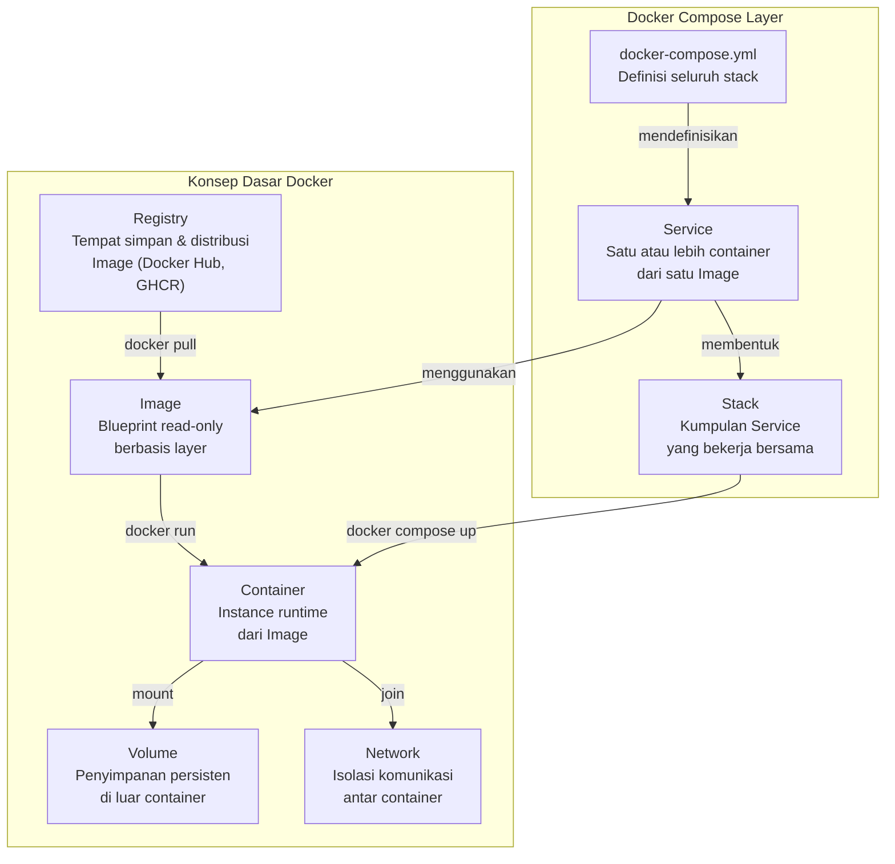
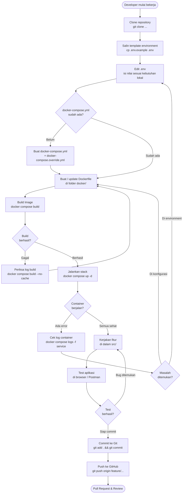
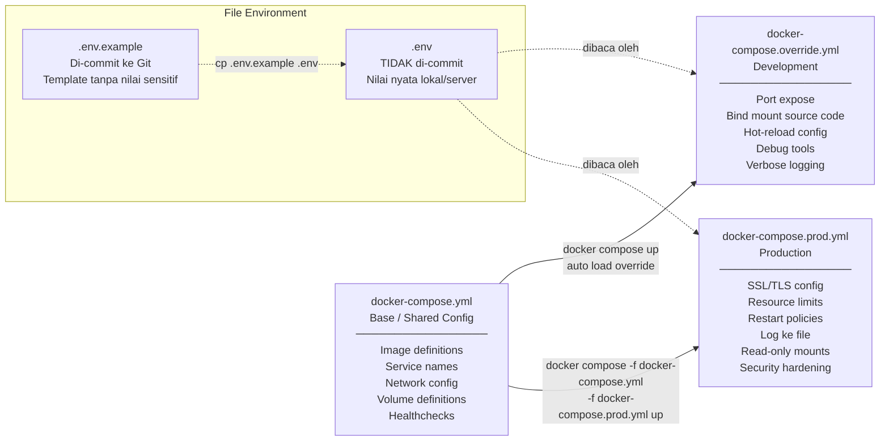
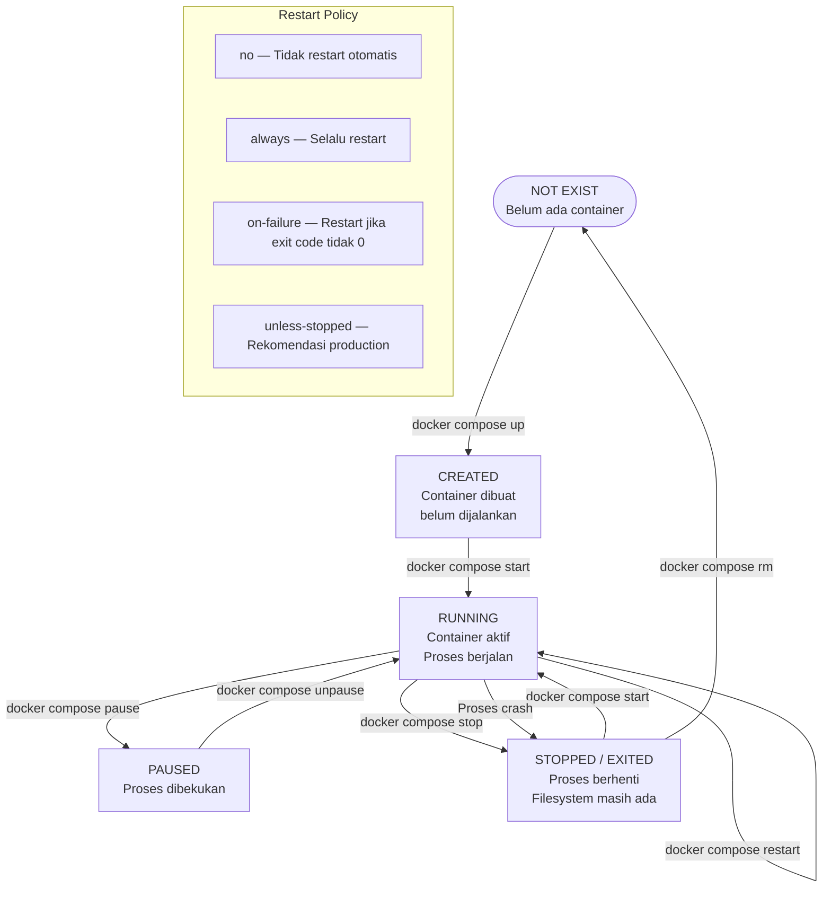
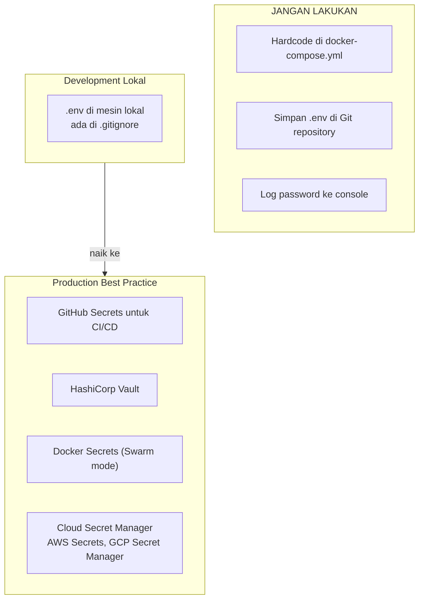
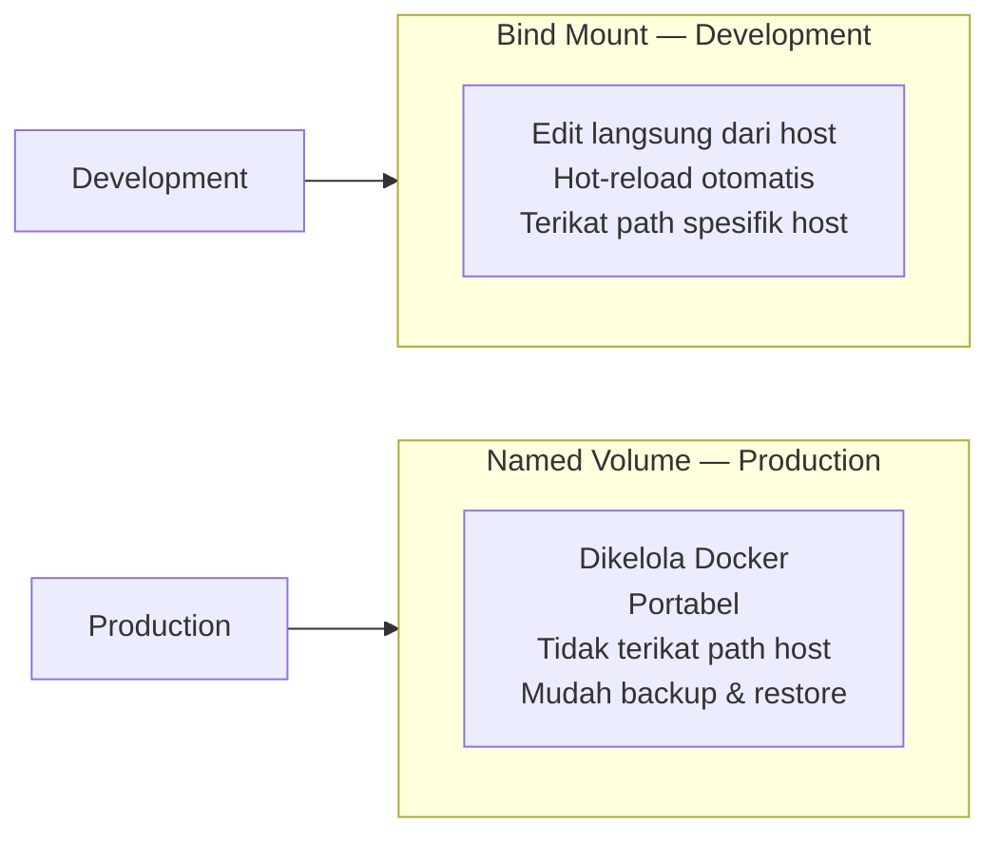
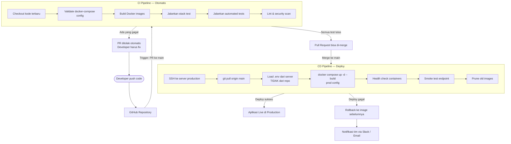

# 🐳 Resume Best Practice: Docker Compose — Konsep, Flowchart & Alur ke GitHub

Dokumen ini adalah panduan lengkap praktik terbaik penggunaan Docker Compose dari awal project hingga deploy dan integrasi GitHub. Cocok sebagai referensi tim atau dokumentasi internal project.

---

## 📋 Daftar Isi

1. [Konsep Inti Docker & Docker Compose](#1-konsep-inti-docker--docker-compose)
2. [Struktur Proyek Best Practice](#2-struktur-proyek-best-practice)
3. [Anatomi docker-compose.yml](#3-anatomi-docker-composeyml)
4. [Flowchart: Alur Kerja Docker Compose](#4-flowchart-alur-kerja-docker-compose)
5. [Flowchart: Strategi Multi-Environment](#5-flowchart-strategi-multi-environment)
6. [Flowchart: Lifecycle Container](#6-flowchart-lifecycle-container)
7. [Best Practice: Konfigurasi](#7-best-practice-konfigurasi)
8. [Best Practice: Keamanan & Secret](#8-best-practice-keamanan--secret)
9. [Best Practice: Networking](#9-best-practice-networking)
10. [Best Practice: Volume & Persistensi Data](#10-best-practice-volume--persistensi-data)
11. [Step-by-Step: Dari Lokal ke GitHub](#11-step-by-step-dari-lokal-ke-github)
12. [Flowchart: CI/CD Pipeline dengan GitHub Actions](#12-flowchart-cicd-pipeline-dengan-github-actions)
13. [Perintah Operasional Harian](#13-perintah-operasional-harian)
14. [Checklist Best Practice](#14-checklist-best-practice)

---

## 1. Konsep Inti Docker & Docker Compose

### Hierarki Konsep



### Perbedaan Kunci

| Konsep | Fungsi | Analogi |
|---|---|---|
| **Dockerfile** | Resep untuk membangun Image | Blueprint rumah |
| **Image** | Hasil build Dockerfile, read-only | Foto cetak blueprint |
| **Container** | Image yang sedang berjalan | Rumah yang sudah dibangun |
| **docker-compose.yml** | Orkestrator multi-container | Denah kompleks perumahan |
| **Volume** | Penyimpanan persisten | Gudang di luar rumah |
| **Network** | Komunikasi antar container | Sistem jalan dalam kompleks |

---

## 2. Struktur Proyek Best Practice

```
project-root/
├── .git/
├── .github/
│   └── workflows/
│       ├── ci.yml                # GitHub Actions: test & lint
│       └── deploy.yml            # GitHub Actions: deploy ke server
├── docker/
│   ├── php/
│   │   ├── Dockerfile
│   │   └── entrypoint.sh
│   ├── nginx/
│   │   └── default.conf
│   └── mysql/
│       └── init/
│           └── 01-schema.sql
├── src/                          # Kode aplikasi
├── .env.example                  # Template (di-commit ke Git) ✅
├── .env                          # Nilai nyata (RAHASIA) ❌ jangan commit
├── .gitignore
├── .dockerignore
├── docker-compose.yml            # Base config (semua environment)
├── docker-compose.override.yml   # Dev config (opsional, hati-hati commit)
├── docker-compose.prod.yml       # Production config
└── README.md
```

> **Prinsip:** Pisahkan konfigurasi base dari konfigurasi environment-spesifik. Gunakan file override untuk dev dan prod.

---

## 3. Anatomi docker-compose.yml

```yaml
# docker-compose.yml — Base Configuration

services:

  # Service Aplikasi Web
  web:
    build:
      context: .
      dockerfile: docker/php/Dockerfile
      args:
        PHP_VERSION: "8.2"
    image: myapp-web:latest
    container_name: myapp_web
    restart: unless-stopped
    depends_on:
      db:
        condition: service_healthy    # Tunggu DB benar-benar sehat
    environment:
      APP_ENV: "${APP_ENV:-production}"
    env_file:
      - .env
    ports:
      - "80:80"
    volumes:
      - ./src:/var/www/html
      - app_uploads:/var/www/html/uploads
    networks:
      - app_network
    deploy:
      resources:
        limits:
          memory: 512M
          cpus: "1.0"

  # Service Database
  db:
    image: mysql:8.0                  # Selalu gunakan tag versi spesifik
    container_name: myapp_db
    restart: unless-stopped
    environment:
      MYSQL_ROOT_PASSWORD: "${DB_ROOT_PASSWORD}"
      MYSQL_DATABASE: "${DB_DATABASE}"
      MYSQL_USER: "${DB_USER}"
      MYSQL_PASSWORD: "${DB_PASSWORD}"
    volumes:
      - db_data:/var/lib/mysql
      - ./docker/mysql/init:/docker-entrypoint-initdb.d:ro
    networks:
      - app_network
    healthcheck:                        # Definisikan healthcheck
      test: ["CMD", "mysqladmin", "ping", "-h", "localhost"]
      interval: 10s
      timeout: 5s
      retries: 5
      start_period: 30s
    deploy:
      resources:
        limits:
          memory: 1G
          cpus: "1.0"

volumes:
  db_data:
    name: myapp_db_data
  app_uploads:
    name: myapp_uploads

networks:
  app_network:
    name: myapp_network
    driver: bridge
```

---

## 4. Flowchart: Alur Kerja Docker Compose



---

## 5. Flowchart: Strategi Multi-Environment



---

## 6. Flowchart: Lifecycle Container



---

## 7. Best Practice: Konfigurasi

### 7.1 Gunakan Tag Image yang Spesifik

```yaml
# BURUK — tidak predictable
image: mysql:latest

# BAIK — deterministik, reproducible build
image: mysql:8.0.36
image: php:8.2-apache
```

### 7.2 Selalu Definisikan Healthcheck

```yaml
services:
  db:
    image: mysql:8.0
    healthcheck:
      test: ["CMD", "mysqladmin", "ping", "-h", "localhost"]
      interval: 10s
      timeout: 5s
      retries: 5
      start_period: 30s
```

### 7.3 Gunakan `depends_on` dengan `condition`

```yaml
services:
  web:
    depends_on:
      db:
        condition: service_healthy   # Tunggu DB benar-benar siap
      cache:
        condition: service_started
```

### 7.4 Terapkan Resource Limits

```yaml
services:
  web:
    deploy:
      resources:
        limits:
          memory: 512M
          cpus: "1.0"
        reservations:
          memory: 128M
          cpus: "0.25"
```

### 7.5 Gunakan `.dockerignore`

```
.git
.github
node_modules
.env
*.log
docker-compose*.yml
README.md
.vscode
```

---

## 8. Best Practice: Keamanan & Secret

### 8.1 Jangan Hardcode Secret

```yaml
# BURUK
environment:
  DB_PASSWORD: "mysecretpassword123"

# BAIK — ambil dari .env atau environment host
environment:
  DB_PASSWORD: "${DB_PASSWORD}"
```

### 8.2 Hierarki Pengelolaan Secret



### 8.3 File `.gitignore` Wajib

```gitignore
# Environment files
.env
.env.*
!.env.example

# Docker override
docker-compose.override.yml

# SSL Certificates
*.pem
*.key
*.crt
ssl/

# Logs
*.log
logs/

# Dependencies
vendor/
node_modules/

# OS files
.DS_Store
Thumbs.db
```

---

## 9. Best Practice: Networking

### 9.1 Isolasi Network per Layer

```yaml
# Pisahkan network frontend dan backend
networks:
  frontend_network:
    driver: bridge
  backend_network:
    driver: bridge

services:
  nginx:
    networks: [frontend_network]

  web:
    networks: [frontend_network, backend_network]

  db:
    networks: [backend_network]   # DB tidak bisa diakses dari frontend
```

### 9.2 Gunakan Nama Service sebagai Hostname

```yaml
# Di dalam container, hubungi service lain via nama service
DB_HOST: db       # nama service (bukan IP atau localhost)
REDIS_HOST: cache
```

---

## 10. Best Practice: Volume & Persistensi Data

### 10.1 Named Volume vs Bind Mount



### 10.2 Strategi Backup Volume

```bash
# Backup named volume ke file tar
docker run --rm \
  -v myapp_db_data:/data \
  -v $(pwd)/backup:/backup \
  alpine tar czf /backup/db_backup_$(date +%Y%m%d).tar.gz -C /data .

# Restore dari backup
docker run --rm \
  -v myapp_db_data:/data \
  -v $(pwd)/backup:/backup \
  alpine tar xzf /backup/db_backup_20240101.tar.gz -C /data
```

---

## 11. Step-by-Step: Dari Lokal ke GitHub

### Gambaran Umum Alur

```mermaid
flowchart TD
    S1(["MULAI"]) --> S2

    subgraph FASE1["FASE 1: Setup Awal"]
        S2["1. Install Tools\nDocker Desktop, Git, VSCode"]
        S2 --> S3["2. Buat Repository di GitHub\ngithub.com → New Repository"]
        S3 --> S4["3. Clone ke lokal\ngit clone https://github.com/user/repo.git"]
        S4 --> S5["4. Buat struktur project\nfolder docker/, src/, .github/"]
        S5 --> S6["5. Buat .env.example\ndan langsung buat .env lokal"]
        S6 --> S7["6. Tambah .gitignore\nmasukkan .env, ssl/, logs/"]
    end

    subgraph FASE2["FASE 2: Konfigurasi Docker"]
        S7 --> S8["7. Buat Dockerfile\ndi docker/php/Dockerfile"]
        S8 --> S9["8. Buat docker-compose.yml\nbase config"]
        S9 --> S10["9. Buat docker-compose.override.yml\ndev config: port, bind mount"]
        S10 --> S11["10. Buat docker-compose.prod.yml\nproduction config: SSL, limits"]
    end

    subgraph FASE3["FASE 3: Test Lokal"]
        S11 --> S12["11. Build & jalankan\ndocker compose up -d --build"]
        S12 --> S13["12. Verifikasi container sehat\ndocker compose ps"]
        S13 --> S14["13. Test aplikasi\nbuka browser / jalankan test"]
        S14 --> S15{"Semua OK?"}
        S15 -->|"Belum"| S12
    end

    subgraph FASE4["FASE 4: Git & GitHub"]
        S15 -->|"OK"| S16["14. Git commit\ngit add . && git commit"]
        S16 --> S17["15. Push ke GitHub\ngit push origin main"]
        S17 --> S18["16. Tambahkan GitHub Secrets\nSettings → Secrets → Actions"]
        S18 --> S19["17. Buat GitHub Actions workflow\n.github/workflows/ci.yml"]
        S19 --> S20["18. Push workflow → CI berjalan otomatis"]
    end

    subgraph FASE5["FASE 5: Deploy ke Server"]
        S20 --> S21["19. SSH ke server production"]
        S21 --> S22["20. Pull perubahan terbaru\ngit pull origin main"]
        S22 --> S23["21. Pastikan .env production\nada di server (TIDAK dari Git)"]
        S23 --> S24["22. Deploy production\ndocker compose -f docker-compose.yml\n-f docker-compose.prod.yml up -d --build"]
        S24 --> S25["23. Verifikasi\ndocker compose ps && curl domain.com"]
    end

    S25 --> END(["SELESAI"])
```



---

### Detail Setiap Step

#### FASE 1 — Setup Awal

```bash
# Verifikasi tools tersedia
docker --version
docker compose version
git --version

# Clone repository dari GitHub
git clone https://github.com/username/nama-project.git
cd nama-project

# Buat struktur folder
mkdir -p docker/php docker/mysql/init .github/workflows src

# Buat .env.example (TEMPLATE — di-commit ke Git)
cat > .env.example << 'EOF'
APP_ENV=development
APP_URL=http://localhost
DB_ROOT_PASSWORD=change_me
DB_DATABASE=myapp_db
DB_USER=myapp_user
DB_PASSWORD=change_me
EOF

# Salin ke .env lokal dan isi nilainya
cp .env.example .env

# Buat .gitignore
cat > .gitignore << 'EOF'
.env
.env.*
!.env.example
docker-compose.override.yml
*.log
logs/
ssl/
*.pem
*.key
*.crt
vendor/
node_modules/
.DS_Store
EOF
```

#### FASE 2 — Konfigurasi Docker

**Contoh Dockerfile:**

```dockerfile
# docker/php/Dockerfile
FROM php:8.2-apache

RUN apt-get update && apt-get install -y \
    libpng-dev libjpeg-dev libzip-dev \
    && docker-php-ext-install gd mysqli pdo pdo_mysql zip opcache \
    && a2enmod rewrite headers

COPY docker/php/entrypoint.sh /entrypoint.sh
RUN chmod +x /entrypoint.sh

WORKDIR /var/www/html
ENTRYPOINT ["/entrypoint.sh"]
CMD ["apache2-foreground"]
```

**Commit file konfigurasi:**

```bash
git add docker/ docker-compose.yml docker-compose.prod.yml .env.example .gitignore
git commit -m "feat(docker): add docker compose configuration"
```

#### FASE 3 — Test Lokal

```bash
# Build dan jalankan
docker compose up -d --build

# Cek status semua service
docker compose ps

# Lihat log real-time
docker compose logs -f

# Lihat log service tertentu
docker compose logs -f web

# Masuk ke container untuk debug
docker compose exec web bash
docker compose exec db mysql -u root -p

# Hentikan semua container
docker compose down
```

#### FASE 4 — Git & GitHub

```bash
# Commit dengan format Conventional Commits
# Format: <type>(<scope>): <deskripsi>
# type: feat, fix, chore, docs, refactor, test, ci

git add src/
git commit -m "feat(app): initial application setup"

# Push ke branch main
git push origin main

# Atau kerja di branch fitur
git checkout -b feature/nama-fitur
git add .
git commit -m "feat: tambah fitur X"
git push origin feature/nama-fitur
# Buat Pull Request di GitHub
```

**GitHub Repository Settings:**

| Setting | Lokasi | Nilai |
|---|---|---|
| Default branch | Settings → General | `main` |
| Branch protection | Settings → Branches | Require PR & status checks |
| GitHub Secrets | Settings → Secrets → Actions | `SERVER_HOST`, `SERVER_USER`, `SSH_PRIVATE_KEY` |
| GitHub Variables | Settings → Variables → Actions | `APP_ENV`, `APP_URL` |

#### FASE 5 — GitHub Actions Workflow

```yaml
# .github/workflows/ci.yml
name: CI Pipeline

on:
  push:
    branches: [main, develop]
  pull_request:
    branches: [main]

jobs:
  lint-and-test:
    runs-on: ubuntu-latest
    steps:
      - name: Checkout code
        uses: actions/checkout@v4

      - name: Validate docker-compose
        run: docker compose config --quiet

      - name: Build Docker image
        run: docker compose build

      - name: Run containers
        run: docker compose up -d

      - name: Wait for services
        run: |
          timeout 60 bash -c \
            'until docker compose ps | grep "healthy"; do sleep 2; done'

      - name: Run tests
        run: docker compose exec -T web php vendor/bin/phpunit

      - name: Teardown
        if: always()
        run: docker compose down -v
```

```yaml
# .github/workflows/deploy.yml
name: Deploy to Production

on:
  push:
    branches: [main]

jobs:
  deploy:
    runs-on: ubuntu-latest
    environment: production
    steps:
      - name: Deploy via SSH
        uses: appleboy/ssh-action@v1.0.0
        with:
          host: ${{ secrets.SERVER_HOST }}
          username: ${{ secrets.SERVER_USER }}
          key: ${{ secrets.SSH_PRIVATE_KEY }}
          script: |
            cd /srv/myapp
            git pull origin main
            docker compose -f docker-compose.yml -f docker-compose.prod.yml \
              up -d --build --remove-orphans
            docker image prune -f
```

#### FASE 5 — Deploy ke Server Production

```bash
# Di server production (via SSH)

# Pastikan .env production ada di server (manual, TIDAK dari Git)
ls -la .env

# Deploy dengan config production
docker compose \
  -f docker-compose.yml \
  -f docker-compose.prod.yml \
  up -d --build --remove-orphans

# Verifikasi semua service
docker compose ps

# Test endpoint
curl -I https://domain.com

# Hapus image lama
docker image prune -f

# Monitor log production
docker compose logs --tail=100 -f
```

---

## 12. Flowchart: CI/CD Pipeline dengan GitHub Actions



---

## 13. Perintah Operasional Harian

### Manajemen Container

```bash
# Jalankan semua service di background
docker compose up -d

# Jalankan dengan build ulang image
docker compose up -d --build

# Hentikan semua service
docker compose stop

# Hentikan dan hapus container (volume tetap)
docker compose down

# Hentikan, hapus container DAN volume (data hilang!)
docker compose down -v

# Restart service tertentu
docker compose restart web
```

### Monitoring & Debug

```bash
# Status semua service
docker compose ps

# Log semua service (follow)
docker compose logs -f

# Log service tertentu, 50 baris terakhir
docker compose logs --tail=50 -f web

# Stats penggunaan resource real-time
docker stats

# Masuk ke bash dalam container
docker compose exec web bash
docker compose exec db mysql -u "${DB_USER}" -p

# Jalankan perintah satu kali
docker compose exec web php artisan migrate
```

### Manajemen Image & Volume

```bash
# Lihat semua image
docker images

# Hapus image yang tidak dipakai
docker image prune -f

# Hapus semua resource yang tidak dipakai
docker system prune -f

# Lihat volume
docker volume ls

# Backup volume database
docker run --rm \
  -v myapp_db_data:/data \
  -v $(pwd)/backup:/backup \
  alpine tar czf /backup/db_$(date +%Y%m%d_%H%M%S).tar.gz -C /data .
```

---

## 14. Checklist Best Practice

### Dockerfile

- [ ] Gunakan base image dengan tag versi spesifik (bukan `latest`)
- [ ] Urutkan perintah dari jarang berubah ke sering berubah
- [ ] Gunakan multi-stage build untuk image lebih kecil
- [ ] Jalankan proses sebagai non-root user
- [ ] Buat `.dockerignore` untuk exclude file tidak perlu

### docker-compose.yml

- [ ] Definisikan `healthcheck` untuk semua service database/cache
- [ ] Gunakan `depends_on` dengan `condition: service_healthy`
- [ ] Terapkan `deploy.resources.limits` di semua service
- [ ] Gunakan `restart: unless-stopped` untuk production
- [ ] Beri nama eksplisit pada volume dan network
- [ ] Pisahkan config ke base + dev override + prod override
- [ ] Tidak ada password/secret yang hardcode

### Git & GitHub

- [ ] `.env` ada di `.gitignore`
- [ ] `.env.example` ada dan terupdate di repository
- [ ] GitHub Secrets diisi untuk CI/CD
- [ ] GitHub Actions workflow dibuat untuk CI dan CD
- [ ] Branch protection aktif di branch `main`
- [ ] Gunakan Conventional Commits untuk pesan commit

### Security

- [ ] Secret dikelola via environment variable atau secret manager
- [ ] Port yang tidak perlu tidak di-expose ke host
- [ ] SSL/TLS aktif di production
- [ ] Database tidak dapat diakses langsung dari internet

### Operasional

- [ ] Strategi backup volume database ada
- [ ] Monitoring log dikonfigurasi
- [ ] Prosedur rollback didokumentasikan
- [ ] Resource limits mencegah satu service menghabiskan semua resource

---

## Referensi Lanjutan

| Topik | Sumber |
|---|---|
| Docker Compose v2 Spec | [docs.docker.com/compose](https://docs.docker.com/compose/) |
| Conventional Commits | [conventionalcommits.org](https://www.conventionalcommits.org/) |
| GitHub Actions Docs | [docs.github.com/actions](https://docs.github.com/en/actions) |
| Docker Security Best Practice | [docs.docker.com/develop/security-best-practices](https://docs.docker.com/develop/security-best-practices/) |
| OWASP Docker Cheat Sheet | [cheatsheetseries.owasp.org](https://cheatsheetseries.owasp.org/cheatsheets/Docker_Security_Cheat_Sheet.html) |

---

*Dokumen ini dibuat berdasarkan arsitektur project Docker PHP7. Sesuaikan nilai konfigurasi, nama service, dan path sesuai kebutuhan project Anda.*
